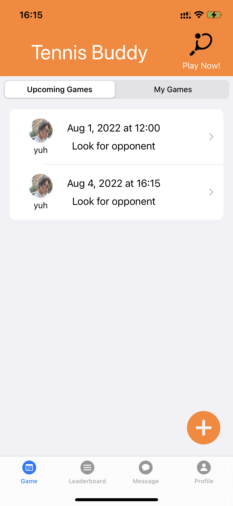
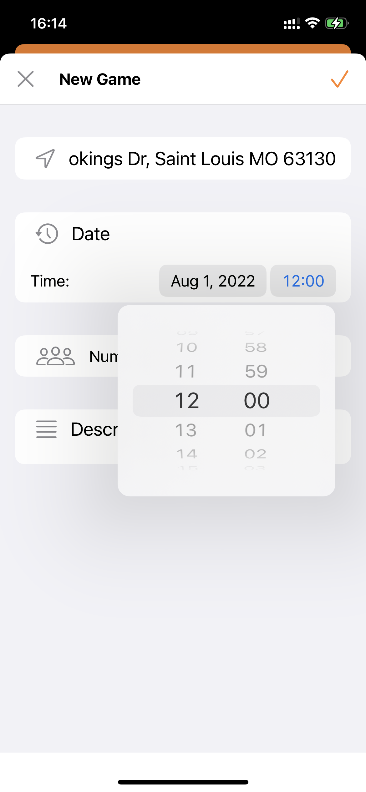
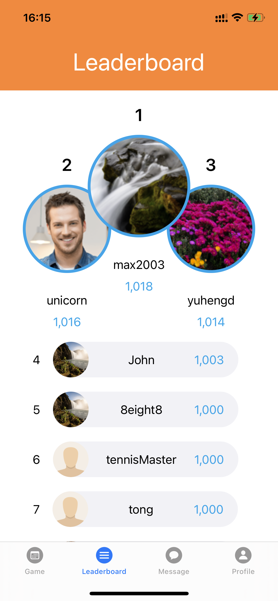
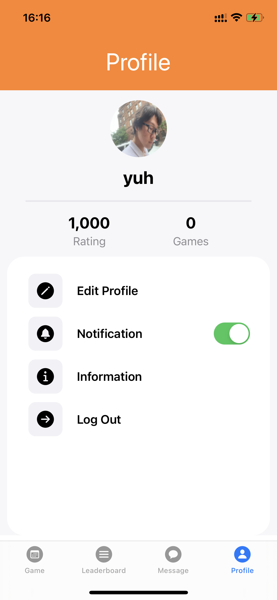

  <!-- img src="./public/left.PNG" width="351" height="759" --->
  
  
  
  

# TennisBuddy
A mobile network for tennis players of various skill levels

## Value Proposition
Check out local tennis games in your community and compete against others in seasonal leagues

## Core Functionalities
User Authentication via Firebase  
Game Scheduling System  
Player ranking using the Elo rating algorithm  
User Profile

## Author
Yuheng Ding
d.yuheng@wustl.edu

## License
This project is licensed under the MIT License - see the LICENSE.md file for details
